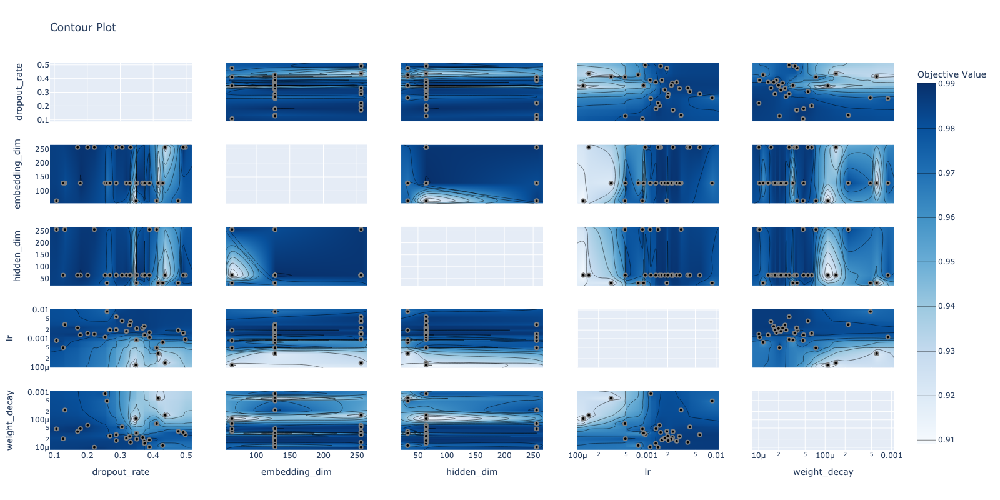

# End-to-End Chatbot Intent Classifier

A intent classification chatbot application written in pytorch and flask that is language agnostic, scalable and dynamic to load any deep learning models. Additionally, I show how to manage and log experiments for trying any varations of the models. The whole architecture is setup through many small services to make it as stateless as possible.

## Intent Classification
This project is a showcase for end-to-end machine learning development process.
It has a deep neural networks based nlp model(97.5% accuracy on test data in some tests), 
docker-based Flask web server, enabling request handling and server interaction 
and put in practise AI engineering at different levels of maturity.
I tried to explain the process in the notebooks, and I believe from there on one can see how the missing pieces will fit in.

## Project Overview
This project focuses on Text Classification for adis data, leveraging a Neural Networks based machine learning model. 
The main purpose is to showcases an end-to-end machine learning analytics development with strong research taste.

## Project Components

Key features and processes within the project include:

1. **Data Preprocessing:** Implementation of a tokenizer and vocabulary builder from scratch and abstracted them. 
2. **Model Training:** Development of a sequence based algorithm (LSTM + Embeddings) for Intent Classification. Refinement of the model using hyperparameter optimization. Addition of a self-attention mechanism for improved performance.
3. **Model Inference:** Application of the trained model to test data. Evaluation of model performance using metrics like confidence, accuracy, precision, recall, F1 score, lift, Roc curve etc..
4. **Model Deployment:** Deployment of the model using a Docker container and Flask web server.
5. **CI/CD Pipeline:** Integration of Continuous Integration and Continuous Deployment Using Docker (other services, for example git tag push, webhooks and automatic deployment are assumed to be given.).
6. **Unit Testing:** A basic testing of flask functionality through pytest.
7. **Logging and Health Checking** Utilization of the Python Logging Module for efficient tracking and debugging. Integration of Prometheus and Grafana for server health monitoring.
8. **Swagger:** Demonstration of sending requests to the Flask server and receiving responses.

## Extra Mile:
1. **Model Abstraction:** Abstraction of the model in the fashion of a Hugging face transformer level.
2. **ML Engineering practise:** for reproducibility of results, fast discovery and updation of models: I tried to show that a combination of tools and tricks build an MLE basis for good results, e.g. Optuna, MLflow, model abstractions, 
json configs setting the environment and flexibility to save and load models, monitoring performance in production through logs and metrics, confidence test, out of sample distributions tests, etc.. They all make a part of very flexible and robust MLE pipeline
4. **Model Monitoring:** Prometheus and Grafana are used for monitoring the Flask server. I installed on my macbook, and shared some screenshots. The server exposes metrics on the /metrics endpoint which are scraped by Prometheus and visualized in Grafana.
5. **Model Logging:** The project has logging for the main model building and inference tasks implemented using the Python logging module. The logs are stored in the `logs` directory which is created once the main script is run. I also created a local db to store the requests and responses, and added a screenshot.
6. **Model Testing:** The project has a basic unit test for the Flask server implemented using pytest. The test can be run using the `pytest` command. Integration tests not done. A bit out scope for the time.
7. **Model Documentation:** The project has a README.md file which contains the project overview and setup instructions.

## Requirements
- Python 3.9.10
- Docker (for Docker-based setup)
- PyCharm or Visual Studio Code (for IDE-based setup)
- Prometheus/ Grafana
- see requirements.txt for module versions

## Quick Start

To run the project from shell/locally , navigate to the project directory and set the PYTHONPATH:
```bash
cd ultimate-ai-challenge
export PYTHONPATH="${PYTHONPATH}:$(pwd)"
```

Create a new project environment with python 3.9 or 3.9.10
```
conda create -n py39 python=3.9
conda activate py39
```
Install the required packages:

```bash
pip install -r requirements.txt
pip install flasgger==0.9.7.1
pip install Flask-SQLAlchemy==3.1.1
```
TODO: include Flask-SQLAlchemy inside the requirements.txt and remove version conflict.

Running the tests:
```bash
pytest
```

### Running the Flask server and :
```bash
python server.py --model=IntentClassifierLSTMWithAttention --port=8080
```

### Making Requests
you can visit localhost
```
http://localhost:8080/apidocs
```
and make requests through swagger interface. Your requests should have proper
json format to get a prediction from intent classification example.
e.g. 
{"text":"find me a flight from chicago to washington"}


you can also check edge cases and errors


you can also make requests by running python make_request.py
```bash
python make_requests.py
```

### Running Experiments/ Python Execution Scripts
1. The experiments require that you have mlflow server running in the backend.
mlflow server --backend-store-uri=mlruns --default-artifact-root=file:mlruns --host 0.0.0.0 --port 1234
2. There are three examples of pipelines in the machine_learning folder that you can run
```
export PYTHONPATH="${PYTHONPATH}:$(pwd)"
python machine_learning/main_example.py
python machine_learning/hyperparameter_optimization.py
python machine_learning/compute_metric.py
```

3. For notebooks, start the jupyter server in the project root and run all cells of the jupyter notebooks. The Jupyter notebooks are numbered via their names. The order of execution shall be kept to avoid overwriting some models. But for experimentation, they should run independently as well.


### 2. Docker Setup
To build and run the project using Docker:
```bash
docker compose build
docker run -p 8080:8080 ultimate-a:ic-1.0
```

### 3. Prometheus and Grafana Setup
install prometheus and grafana, you can check metrics. To run the project with Prometheus and Grafana:
```bash
brew install prometheus
brew install grafana
brew services start grafana
```
in the project root directory, run:
```bash
prometheus --config.file=prometheus.yml
```
You can configure in yaml, how often you want server to be scraped for the metrics defined in server.py

now prometheus is running on localhost:9090 and grafana on localhost:3000. You can login to grafana with admin/admin.
I have implemented two metrics in the flask file.  REQUEST_COUNT and REQUEST_LATENCY. You can easily configure prometheus to get those metrics. They will help you in maintaining server health. Other metrics can also be defined. Similarly Grafan can be configured to get those metric.

Prometheus metrics collection log can also be checked


Similary a grafana dash board can be configured to run with prometheus.


You can write a dashboard from the project root directory. TODO: Write a dashboard in file "grafana_dashboard.json". The application is exposing some metrics on the endpoint /metrics. You will see the metrics on the dashboard. 

### 4. Optuna and mlflow 
(Distributed Hyperparameter optimization and Experiment tracking, ML pipelines, Model management and deployment)
```bash
pip install optuna mlflow optuna-dashboard
mlflow server --backend-store-uri=mlruns --default-artifact-root=file:mlruns --host 0.0.0.0 --port 1234
╰─ optuna-dashboard sqlite:///IntentClassifierLSTMWithAttention.db --port 9034
```
optuna dashboard is running at http://localhost:9034
I have already a database for the study I coducted. You can visit the dashboard and explore studies.

If you have run some experiments, and running the same ports, you can visit mlflow server at
```
http://127.0.0.1:1234/
```


You will see mlflow server with some experiments, you can configure the dash board to view hyperparamters. And also check model logging and charts, it has a lot of facitlities. I have logged my experiments and here is a view of my mlflow server. Because the mlruns directory for mlflow server stores a lot of model information and charts, I am not making it a part of github, otherwise my git repo will become too huge, which is already quite big because I am shipping a few blobs with it.


Both of them are production ready scalable toole for distributed training, experimenting and model management. I have done a local setup but the backend can easily be databases/ blob stores in cloud. For their operation, I can show in a meeting or see some screen shots. The following image shows the contours of the decision surface for ELST-Attention model corresponding its hyper parameters used to train it.




Logging done for flask. Requests and responses are stored in SQLite DB in instance directory. This can be any DB over the network/cloud as well.  The text logs are stored in the `logs` directory which is created once the server script is run.

TODO: logging for the main model building and inference tasks implemented using the Python logging module. 

## CI/CD Pipeline
The CI/CD pipeline's basic component docker is implemented. Creating webhooks for automatic build and deployment to a deployment tool akin to kubernetes is not done. 
process could be assumed below:
1. Create a new tag in git repo. Configure a webhook
2. Pipeline will be triggered, build the docker image and push the docker image to a container registry
3. Kubernetes or app service is configures to be deployed with the latest image


## Project Structure
The project is structured as follows: TODO: Repo Refactoring with better code organization in master Brnach
```bash
├── 1. Model Training.ipynb
├── 2. Hyperparameter Optimization.ipynb
├── 3. Model Evaluation.ipynb
├── 4. Model Abstraction, Transformers .ipynb
├── :db #Optuna
├── Dockerfile
├── README.md
├── config
│   └── IntentClassifierLSTMWithAttention.json
├── config_bert.py
├── data
│   ├── atis
│   │   ├── ood.tsv #out of sample data train
│   │   ├── ood_test.tsv #out of sample data test
│   │   ├── test.tsv
│   │   └── train.tsv
│   ├── lock # Request Response db
│   └── queries.active # Request Response db
├── docker-compose.yml
├── intent_classifier.py
├── log_handler.py
├── machine_learning
│   ├── IntentClassifierLSTM.py
│   ├── IntentClassifierLSTMWithAttention.py
│   ├── IntentTokenizer.py
│   ├── compute_metric.py
│   ├── hyperparameter_optimization.py
│   ├── main_example.py
│   └── model_utils.py
├── main.py
├── make_requests.py #Make 100 requests to the server, a loop to check latency
├── model_state_dict.pth #state dict of the model
├── models # Model store for reproducibility
│   ├── E-LSTMAmodel.pth
│   ├── IntentClassifierLSTMWithAttention.pth
│   ├── IntentClassifierLSTMWithAttention_le.pickle
│   ├── IntentClassifierLSTMWithAttention_le_example.pickle
│   ├── IntentClassifierLSTMWithAttention_main_example.pth
│   ├── IntentClassifierLSTMWithAttention_main_example_le.pickle
│   ├── IntentClassifierLSTMWithAttention_main_example_tokenizer.pickle
│   ├── IntentClassifierLSTMWithAttention_state_dict.pth
│   ├── IntentClassifierLSTMWithAttention_tokenizer.pickle
│   ├── IntentClassifierLSTMWithAttention_tokenizer_example.pickle
│   ├── best_ICELSTMAmodel.pth
│   ├── best_ICELSTMAmodel_le.pickle
│   ├── best_ICELSTMAmodel_ood.pth
│   └── best_ICELSTMAmodel_tokenizer.pickle
├── plot_parallel_coordinate.png #Hyper parameter space visualization
├── plotly_contours.png #Hyper parameter space visualization
├── prometheus.yml 
├── requirements.txt
├── screenshots #Screenshots for different apps working, for more see master branch, which is work in progress
│   ├── Request_response_Database.png
│   ├── Swagger.png
│   ├── grafana.png
│   ├── prometheus-metrics-collector.png
│   └── prometheus_data_collection.png
├── server.py
├── tests #unit tests for some functionality
│   ├── conftest.py
│   └── test_flask.py
└── utils.py #some utilities
```
## Project Components

The project folder has the following structure:
- **Dockerfile**: Contains the Dockerfile for the project.
- **README.md**: Contains the project overview and setup instructions.
- **requirements.txt**: Contains the required packages for the project.
- **prometheus.yaml**: contains the prometheus configuration.
- **config**: Contains some of the configuration files for the project. TODO: Configuration files for application, e.g. logging, and model initialization JSON files for loading at runtime
- **data**: Contains input data. TODO: refactor, so that the most of the learning data, blobs, database, trained model state dictionaries, and results are here and ignore for git.
- **docker-compose.yml**: Contains the docker-compose file for the project.
- TODO: **app**: Contains the Flask web server for handling requests.
  - **make_requests.py**: the script for making requests to the Flask server.
  - **server.py**: Contains the server script for the flask.
  - **machine_learning**: Contains the machine learning code for the project. TODO: refactor, see example in master branch.
      - **IntentClassifierLSTM.py**: Contains the code for the LSTM model.
      - **IntentClassifierLSTMWithAttention.py**: Contains the code for the LSTM with Attention model.
      - **IntentTokenizer.py**: Contains the code for the tokenizer.
      - **compute_metric.py**: Contains the code for computing the metrics.
      - **hyperparameter_optimization.py**: Contains the code for hyperparameter optimization.
      - **main_example.py**: Contains the code for training first model.
      - **model_utils.py**: Contains the code for the model utilities.
  Contain the Jupyter notebooks used for model training. Notebooks are numbered in the order of execution. and tell the story of the project.
  - 1.Model Training.ipynb => This notebook contains the training of the basic models, LSTM and LSTM with Attention.
  - 2.Hyperparameter Optimization.ipynb => This notebook contains the hyperparameter optimization of the LSTM with Attention model 
  - 3.Model Evaluation.ipynb => This notebook contains the evaluation of the LSTM with Attention model , and strategies to improve the model 
  - 4.Model Abstraction, Transformers .ipynb => This notebook contains the abstraction of the model to a transformer model 

**Important Note:**
Whenever there is an error for project path or module not found, please set the PYTHONPATH to the project root directory
```
export PYTHONPATH="${PYTHONPATH}:$(pwd)"
```

**Improvements:**
1. Many free parameters and fixed values are used in the code, which can be moved to the json config files.
2. The code organization, directory structure, etc. can be improved a lot. I did try it by creating a master branch from main, but was taking too much time in refactoring. A working code is better than a perfect repo. If you see some issues at all, have a look at the master branch, and imagine how would I structure the code. 
3. The git repo size is not small, because I am adding some models for reproducibility sake. 
4. As said, my focus is to show the end-to-end process, and I am quite proud of the effort I put in a week. I hope you like it.
5. There are tons of things that can be done, from improvement in architecture, MLE pipeline to explainability of models. Let's discuss them in the next round. I am very excited to talk about them.
